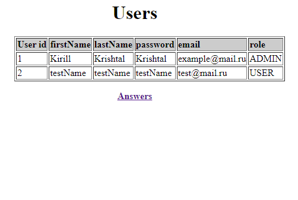

lab 3 - Questions platform
--
В данной работе был выбран Spring boot.

Выбор заключается в том, что Spring boot имеет можество инструментов вкллючая инструменты
для реализации REST и XSLT-преобразований.

JAX-RS хороший инструмент для создания RESTful веб-сервисов, но скорее всего проигрывает в поддерживающем сообществе разработчиков.

В данной работе были созданы REST точки взаимодействия, выполнения CRUD функций.

И также было создано XSLT преобразование, которе изменяет входные XML данные.

Пример таблиц

